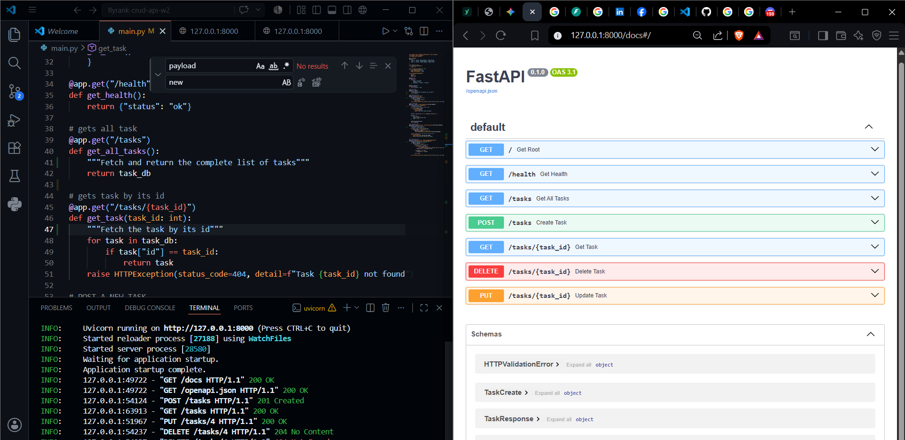

# flyrank-crud-api-w2

> A fast, lightweight, and fully functional CRUD API for managing tasks built with **Python 3.10+**, **FastAPI**, and **SQLite**. Designed for high reliability, clean input validation, persistent database storage, and automatic OpenAPI documentation.

---

## 🚀 Key Features

* 🛠️ **Full CRUD Capabilities:** Support for Creating, Reading, Updating, and Deleting tasks with persistent SQLite storage.
* 🛡️ **Defensive Validation:** Strict input handling returning `400 Bad Request` for empty payloads.
* 🔍 **RESTful Status Codes:** Standardized HTTP response codes (`200`, `201`, `204`, `400`, `404`).
* 📖 **Interactive Documentation:** Instant Swagger UI testing sandbox provided out-of-the-box.

---

## 🛠️ Tech Stack & Dependencies

* **Language:** `Python 3.10+`
* **Framework:** `FastAPI`
* **Database:** `SQLite` (`sqlite3`)
* **ASGI Server:** `Uvicorn`
* **Data Validation:** `Pydantic`

---

## 🗄️ Database Architecture

* **Engine:** SQLite 3 (Lightweight, serverless, single-file database).
* **Storage Path:** Local `./tasks.db` file in the project root.
* **Lifecycle:** Automatically created and seeded with initial sample tasks on startup if the file does not exist. Included in `.gitignore` to prevent tracking local test data.

---

## 💻 Getting Started

### 1. Clone the Repository
```bash
git clone [https://github.com/BeginnerBoi1/flyrank-crud-api-w2-A2.git](https://github.com/BeginnerBoi1/flyrank-crud-api-w2-A2.git)
cd flyrank-crud-api-w2-A2
```


### 2. Install Dependencies
```bash
pip install fastapi uvicorn pydantic
```


### 3. Run the API Server
```bash
uvicorn main:app --reload
```

### preview

